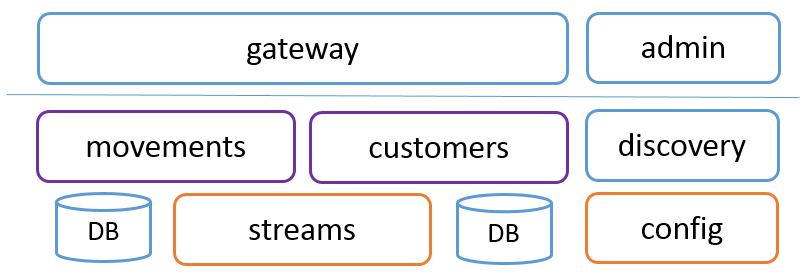
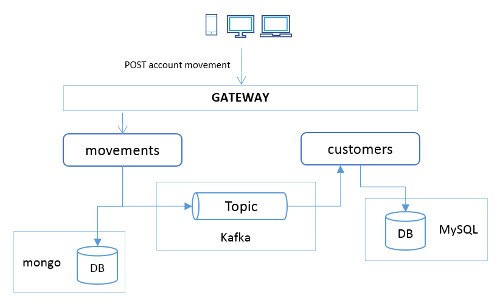
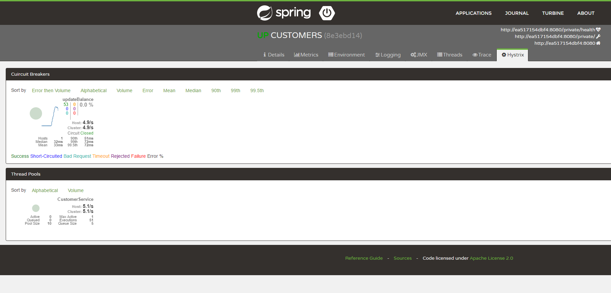
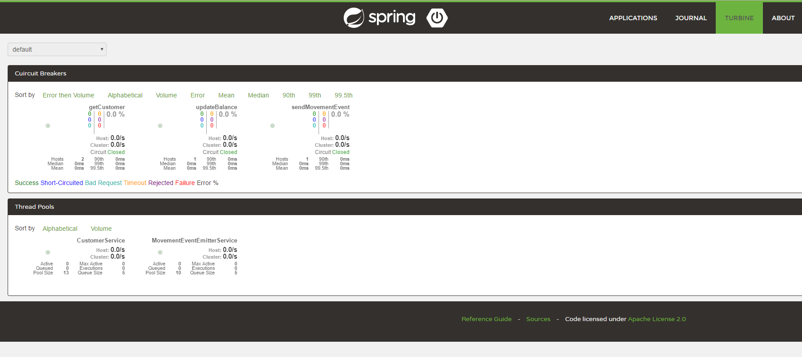
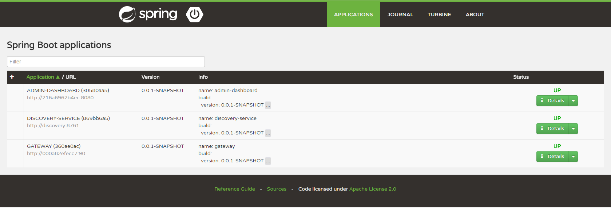
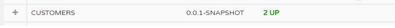

# JBCNConf-Microservices_0-100
This repository is created to host the Microservices from 0 to 100 at JBCNConf 2017

# Event Sourcing Microservices 

## Introduction

This reference application is a Spring Cloud example of using event sourcing in microservices. 
The microservices were developed following the *Share Nothing* approach.

Stack:
 - [Spring Boot](https://projects.spring.io/spring-boot/)
 - [Spring HATEOAS](http://projects.spring.io/spring-hateoas/)
 - [Spring Cloud Netflix](https://cloud.spring.io/spring-cloud-netflix)
 - [Spring Cloud Stream](https://cloud.spring.io/spring-cloud-stream/)
 - [Spring Data](http://projects.spring.io/spring-data/)
    - [Spring Data JPA](http://projects.spring.io/spring-data-jpa/)
    - [Spring Data MongoDB](http://projects.spring.io/spring-data-mongodb/) 

Platform Stack: 
 - [Apache Kafka](https://kafka.apache.org/)
 - [mySQL](https://www.mysql.com/)
 - [mongoDB](https://www.mongodb.com)

Deployment: 
 - [Docker](https://www.docker.com/)
 - [Docker Compose](https://docs.docker.com/compose/)
 - [Docker Machine](https://docs.docker.com/machine/)

### Architecture 

  Overview:

 
 
  The architecture is based on the Spring Cloud Netflix stack:
 
  * Eureka for servicce discovery
  * Zuul for API Gateway 
  * Hystrix for Circuit Breaker
  * Configuration Server to allocate and serve remote configuration. 

 Moreover, Spring Cloud Stream was added for event sourcing with Kafka as event log. The communication between microservices is done through Kafka topics, where some microservices 
 will act as procuders and others will consume those events. 
 Each microservice manages its own data and each microservice is using its own database engine, relational database or NoSQL database depending on the microservices features. 
 There is no REST communication between microservices.      
 
 Use Case: 
 
 
 
 Description:
 
 * The Customer microservice owns the customer information. One customer has an Account with a balance. 
 
 * The Movements microservice manages account movements. When a new movement is created, it stores the movement into the database and publish an event into the Kafka Topic. 
 
 * The Customer microservice consumes the Movements Topic and updates the account balance with the movement amount. 
 
## Project Layout

This is a Multi Module Maven project, just to prove the architecture glue. In a real scenario, each part of the architecture will own its own Git repositroy and will have its own life cycle. 

### Requirements

The requirements for running this demo on your machine are found below.

* Maven 3
* Java 8
* Docker
* Docker Compose
* cUrl (optional)

* Docker images used (download)
  * docker pull spotify/kafka
  * docker pull mysql:8.0
  * docker pull java:8-jre-alpine
  * docker pull mongo

#### Docker Configuration 

##### Docker for Mac or Windows 
  
* Assign more RAM - 4gb recommended
* Set the *DOCKER_HOST_IP* environment variable with the Docker Host IP or just *localhost*.

  ```
  $ export DOCKER_HOST_IP=localhost
  ```

##### Usign Docker Toolbox with Virtualbox  (TBDN)

- Assign More RAM 

  It's recommended to increase the assigned memory

  Example using Docker Machine: 

  ```
  $ docker-machine create --driver virtualbox default --virtualbox-memory 8192
  ```

  or change the VM settings on Virtualbox settings. 

- Set the *DOCKER_HOST_IP* environment variable with the Docker Host IP.

  ```
  $ export DOCKER_HOST_IP=$(docker-machine ip ${DOCKER_MACHINE_NAME:-default})
  ```


#### Build 

Build all the modules. 

The build phase will execute:

 * The unit test
 * Generate and install the package (JAR) on the maven repository.
 * The Docker image. The maven-docker-plugin will build the Docker image using the Dockerfile located at *src/main/docker* folder for each submodule.
   
```
 mvn clean install
``` 

#### Unit Test

Execute unit test 

```
 mvn clean test
``` 

## 1 - Infrastructure platform

### Network

Create the Docker network that will be used by all the containers.

```
$ docker network create msworkshop_jbcnconf
```

```
$ docker network ls

NETWORK ID          NAME                DRIVER              SCOPE
bce266704e4a        bridge              bridge              local
01aab5a5c576        host                host                local
b33c24afad5f        msworkshop_jbcnconf bridge              local
a0b3a85064f3        none                null                local
```


### Kafka

[Apache Kafka](https://kafka.apache.org/) - *distributed streaming platform* - is used as event log. 

The [spotify/kafka](https://hub.docker.com/r/spotify/kafka/) image is used in this project.

Image features:

* No dependency on an external Zookeeper host, or linking to another container
* Zookeeper and Kafka are configured to work together out of the box

Docker Compose configuration for Zookeeper+Kafka:   

```yml
kafka:
    image: spotify/kafka
    container_name: kafka
    environment:
      - ADVERTISED_HOST=kafka
      - ADVERTISED_PORT=9092
    ports:
      - 9092:9092
      - 2181:2181 
 ``` 

**NOTE:** If your are using Deocker for Mac you'll need to change ```container_name``` by ```hostname```.

### Config Server

[Spring Cloud Config](https://cloud.spring.io/spring-cloud-config) *provides server and client-side support for externalized configuration in a distributed system*.
With the Config Server you have a central place to manage external properties for applications across all environments. 
Spring Cloud Config server pulls configuration for remote clients from a [Git](https://github.com/marcelogft/microservices-config) repository. 

The sample architecture is using the *Config First* bootstrap approach. 

*Config First*

All the architecture components depend on the Config Server. When a config client starts up it binds to the Config Server (using *spring.cloud.config.uri*) and initializes Spring Environment with remote property sources. The net result of this is that all client apps that want to consume the Config Server need a bootstrap.yml (or an environment variable) with the server address in *spring.cloud.config.uri*.

*Registry First*

All the microservices depend on the Eureka registry, including the Config Server which is registered with the Discovery Service as well. The net result of that is that client apps all need a bootstrap.yml (or an environment variable) with the appropriate discovery configuration. For example, with Spring Cloud Netflix, you need to define the Eureka server address, e.g. in *eureka.client.serviceUrl.defaultZone*. The **price** for using this option is an **extra network round trip** on start up to locate the service registration. The **benefit** is that the Config Server can change its co-ordinates, as long as the Discovery Service is a fixed point. The default service id is "configserver" but you can change that on the client with *spring.cloud.config.discovery.serviceId* (and on the server in the usual way for a service, e.g. by setting spring.application.name).

#### Config

Docker Compose configuration for Config Server: 

```yml
  config:  
    image: jbcnconf/config-server
    restart: on-failure:10
    container_name: config 
    depends_on:
      - kafka   
    ports:
      - 8888:8888   
    expose:
      - 8888
```

### Run platform

After building the images with:

```
mvn clean install 
```

Run Kafka and Config Server containers executing: 

```
$ docker-compose -f docker-compose.yml up -d
``` 

#### Check 

Execute: 

```
$ docker ps
``` 

to check that both containers are running. 

Sample output: 

```
CONTAINER ID        IMAGE                    COMMAND                  CREATED             STATUS              PORTS                                            NAMES
375325f2d2a6        jbcnconf/config-server   "java -Djava.secur..."   19 seconds ago      Up 18 seconds       0.0.0.0:8888->8888/tcp                           config
189cb7bbcf73        spotify/kafka            "supervisord -n"         19 seconds ago      Up 18 seconds       0.0.0.0:2181->2181/tcp, 0.0.0.0:9092->9092/tcp   kafka
``` 

* Check the Config Server is running properly: 

```
$ docker logs config 
```

Sample output: 

```
s.b.c.e.t.TomcatEmbeddedServletContainer : Tomcat started on port(s): 8888 (http)
c.gft.jbcnconf.config.ConfigApplication  : Started ConfigApplication in 32.822 seconds (JVM running for 36.967)
```

Go to *http://DOCKER_HOST_IP:8888/config-server/discovery-service* 

and the Config Server must return the configuration available (*JSON*) for the discovery-service. 

```json
{
  "name": "config-server",
  "profiles": [
    "discovery-service"
  ],   
  ...      
```

* Check that Zookeeper/Kafka image is running properly, execute: 

```
$ docker logs kafka 
```

Sample Output: 

```
success: zookeeper entered RUNNING state, process has stayed up for > than 1 seconds (startsecs)
success: kafka entered RUNNING state, process has stayed up for > than 1 seconds (startsecs)
``` 

Optionally you can add the [Kafka Manager](doc/kafka_manager.md) UI.  

## 2 - Microservices platform

### Service Discovery
Service Discovery is one of the key tenets of a microservice based architecture. Trying to hand configure each client or some form of convention can be very difficult to do and can be very brittle. Eureka is the Netflix Service Discovery Server and Client. 

```yml
  discovery:
    image: jbcnconf/discovery
    restart: on-failure:10 
    container_name: discovery      
    expose:
      - 8761
    ports:
      - 8761:8761 
```

Eureka dashboard will be available at: *http://$DOCKER_HOST_IP:8761*

### API Gateway

Zuul is a JVM based router and server side load balancer by Netflix.

Docker compose: 

```yml
gateway:  
  image: jbcnconf/api-gateway
  restart: on-failure:10
  container_name: gateway
  depends_on:  
    - discovery  
  expose:
    - 90
  ports:
    - 90:90   
```

Zuul will be available at: *http://$DOCKER_HOST_IP:90*. (A 404 is returned if you try to browse the URL, Zuul only acts as a router)

### Dashboard

[Spring Boot Admin](https://github.com/codecentric/spring-boot-admin) admin interface for Spring Boot applications.

Spring Boot Admin provides a centralized monitoring site for microservices with a lot of features like;
Health status, JVM & memory metrics, show build-info number,view JVM system- & environment-properties, loglevel management, interact with JMX-beans, view thread dump, view traces, Hystrix-Dashboard integration, download heapdump, Notification on status change (via mail, Slack, Hipchat, ...) and 
event journal of status changes.

Docker compose: 

```yml
  dashboard:
    image: jbcnconf/admin-dashboard
    container_name: admin-dashboard
    restart: on-failure:10
    depends_on:  
      - discovery  
    ports:
      - 8090:8080
    expose:
      - 8080
```

Spring Boot Admin dashboard will be available at: *http://$DOCKER_HOST_IP:8090*
It's recommended to *Enable notifications* when your browser ask for enable them. 

#### Hystrix
   
  Circuit breaker. When calls to a particular service reach a certain threshold, the circuit opens and the call is not made. In cases of error and an open circuit a fallback can be provided by the developer.
  The Spring Boot Admin integrates the Hystrix view for each microservice.It consumes the */hystrix.stream* microservice endpoint.  

  

  The Hystrix stream must be enabled at the Spring Boot application with:  
   
  ```java
  @EnableHystrix
  ```  
  Then the methods could be annotated with ```@HystrixCommand``` annotation to enable Hystrix.
  
#### Turbine

   Turbine is an application that aggregates all of the relevant */hystrix.stream* endpoints into a combined */turbine.stream* for use in the dashboard. Individual instances are located via Eureka

  

### Run 

Run Eureka, Zuul and Admin Dashboard containers:

```
docker-compose -f docker-compose-ms.yml up -d
``` 

- Check everything is working 

    - Check the Zuul is alive  

      ```
      $ docker logs gateway
      ```
    
      Sample output: 

      ```
       s.b.c.e.t.TomcatEmbeddedServletContainer : Tomcat started on port(s): 90 (http)
       s.c.n.e.s.EurekaAutoServiceRegistration : Updating port to 90
       c.g.jbcnconf.gateway.GatewayApplication  : Started GatewayApplication in 55.204 seconds (JVM running for 58.139)
      ```

  - Open the Eureka dashboard at *http://$DOCKER_HOST_IP:8761* with your browser. The Eureka dashboard has no features and could be disabled by the Eureka configration, as we'll use the Spring Boot Admin.   

  - Open the Spring Boot Admin dashboard at *http://$DOCKER_HOST_IP:8090* with your browser 

    

## 3 - Microservices  

All the mircroservices are [Spring Boot](https://projects.spring.io/spring-boot/) applications. 

The package layout for all the developed microservices: 

- **config**: Configuration beans
- **domain**: Domain model
- **repository**: Data repositories
- **services**: Service business logic 
- **event**: Event managment
- **controller**: REST Controller
- **resurce**: HATEOAS resource builder
- **Application.java**: Spring Boot application

* The *src/main/docker* folder contains the Dockerfile for building the Docker image. 

The [spotify/docker-maven-plugin](spotify/docker-maven-plugin) is used to build the Docker image with Maven. 

```xml
<plugin>
  <groupId>com.spotify</groupId>
  <artifactId>docker-maven-plugin</artifactId>
  <version>${docker.plugin.version}</version>
  <executions>
   <execution>
    <phase>package</phase>
    <goals>
      <goal>build</goal>
    </goals>
   </execution>
  </executions>
  <configuration>
    <imageName>${docker.image.prefix}/${project.artifactId}</imageName>
    <dockerDirectory>${project.basedir}/src/main/docker</dockerDirectory>
    <resources>
      <resource>
        <targetPath>/</targetPath>
        <directory>${project.build.directory}</directory>
        <include>${project.build.finalName}.jar</include>
      </resource>
    </resources>
  </configuration>
</plugin>
``` 

### Movement service

The Movement service manages account movements.
 
The Movement document is an entity with the movement information:
* The movement type 
* The account reference 
* The amount. 

Available movement types:

```java
public enum MovementType {
	RESTAURANT,
	HOTEL, 
	SUPERMARKET,
	BOOKSHOP,
	TRANSPORT
```

#### Remote Configuration

As the service configuration is managed by the Config Server, we need to provide the Config Server URL to the Movements service.
The application name will be used by the Config Server to allocate the service configuration when requeste for this service.  

*src/main/resources/bootstrap.yml*

```yml
server:
  port: 8080
spring: 
  application:
    name: movements 
  cloud:  
    config:       
      uri: http://config:8888
      failFast: true
      user: user
      password: password 

```

#### Database

Movement service uses [Spring Data MongoDB](http://projects.spring.io/spring-data-mongodb) for MongoDB document database integration. 

[Fongo](https://github.com/fakemongo/fongo) - *faked out in-memory mongo for Java*, is used for unit testing. 

pom.xml

```xml
  <dependency>
    <groupId>org.springframework.boot</groupId>
    <artifactId>spring-boot-starter-data-mongodb</artifactId>
  </dependency> 
  <dependency>
    <groupId>com.github.fakemongo</groupId>
    <artifactId>fongo</artifactId>
    <version>2.1.0</version>
    <scope>test</scope>
  </dependency>
```

Spring Data MongoDB configuration:

```
 data:
    mongodb:
      host: movementsdb
      port: 27017
      database: movements
```

#### API

Routes configuration. The service must be routed to be accessible through the gateway, we need to add the route at the Zuul configuration. 

```yml
  movements:
      path: /movement/**    
      serviceId: movements
      stripPrefix: false
```

The Movement service exposes a *POST HTTP* method to create new movements. 

- **POST** - *http://$DOCKER_HOST_IP:90/movement*

  - Headers: *Content-type: application/json*
  - Body (*JSON*) example:

```json 
{
	"accountId": 1,
	"type": "HOTEL",
	"amount": 100  
}
```

Example using **cUrl**:

```
curl -H "Content-Type: application/json" -X POST -d '{"accountId": 1,"type": "HOTEL", "amount": 100 }' http://$DOCKER_HOST_IP:90/movement
```

You can use the */scripts/post-movements.sh*, a basic bash script, to POST N (script arg) random movements.

Example: POST 2 random movements. 

```
$ ./post-movements.sh  2
Posting 2 movements...
 Posting --> {"accountId": 3,"type": "SUPERMARKET", "amount":189}
Response --> {"id":"aba5ce7d-7898-41a0-a9ae-2cc3aba201fe","accountId":3,"type":"SUPERMARKET","amount":189.0,"when":1497462350147}

 Posting --> {"accountId": 2,"type": "HOTEL", "amount":321}
Response --> {"id":"de36fdd7-04d6-4111-92fb-f66ea01622f7","accountId":2,"type":"HOTEL","amount":321.0,"when":1497462350322}
```

The Movement service exposes a *GET HTTP* method to retrieve movement information with the supplied movement ID. 

- **GET** -  *http://$DOCKER_HOST_IP:90/movement/{id}*

  Example: *http://$DOCKER_HOST_IP:90/movement/d19a0bd5-88b5-4f73-9fc0-3cc1c7611837*

```json
{
    "id": "d19a0bd5-88b5-4f73-9fc0-3cc1c7611837",
    "accountId": 1,
    "type": "HOTEL",
    "amount": 100,
    "when": 1495551475723,
    "_links": {
        "self": {
            "href": "http://192.168.99.100:90/movement/d19a0bd5-88b5-4f73-9fc0-3cc1c7611837"
        }
    }
}
```

#### Producer

When a new movement it's created, the service will create and send a new *MovementEvent* to the movements output channel, the **movements** Kafka topic.
 
Spring Cloud Stream provides a Kafka starter to add the Kafka binder. 
  
pom.xml:

```
 <dependency>
   <groupId>org.springframework.cloud</groupId>
   <artifactId>spring-cloud-starter-stream-kafka</artifactId>
 </dependency>
```

The MovementEvent contains all the Movement information and information about the event itself: 
* The event ID: a random UUID
* The event type, *MovementEventType.CREATED* in this case. 
* The timestamp about when the event was created.

Spring Cloud Stream binding configuration:

```yml
  cloud: 
    stream:
      bindings: 
        output:
          destination: movements
          content-type: application/json
```

#### Docker Compose: 

```
  movementsdb:
    image: mongo
    restart: on-failure:10
    container_name: movementsdb 
  
  movements:  
    image: jbcnconf/movements-service
    restart: on-failure:10 
    depends_on:
      - movementsdb    
```

### Customers 
The Customer service manages the Customer entity. The Customer entity has some basic Customer data, like the Customer name or the Customer e-email and Customer Account with a balance. 

#### Remote Configuration

As the service configuration is managed by the Config Server, we need to provide the Config Server URL to the Customer service.
The application name will be used by the Config Server to allocate the service configuration when requeste for this service.  

*src/main/resources/bootstrap.yml*

```yml
server:
  port: 8080
spring: 
  application:
    name: customers 
  cloud:  
    config:       
      uri: http://config:8888
      failFast: true
      user: user
      password: password 

```

#### Database

The Customers services is connecting to a mySQL database, using the Spring Data JPA for the implementation and the mySQL connector for Java. 
The H2 in-memory database is used for unit testing.
 
pom.xml: 

```xml
  <dependency>
    <groupId>org.springframework.boot</groupId>
    <artifactId>spring-boot-starter-data-jpa</artifactId>
  </dependency> 
  <dependency>
    <groupId>mysql</groupId>
    <artifactId>mysql-connector-java</artifactId>
    <scope>runtime</scope>
  </dependency>
  <dependency>
    <groupId>com.h2database</groupId>
    <artifactId>h2</artifactId>
    <scope>test</scope>
   </dependency>
```

Spring Data JPA configuration: 

```
  jpa:
    hibernate: 
      ddl-auto: create-drop  
  datasource:
    url: jdbc:mysql://customersdb:3306/customers  
    username: root
    password: dbpass
    initialize: true 
```


The database is initialized with three Customers on service start using the ```create-drop``` Hibernate property. 
The Account balance is set to 1000 for each one. 

#### API

Routes configuration. The service must be routed to be accessible through the gateway, we need to add the route at the Zuul configuration. 

```
  customers:
    path: /customers/**    
    serviceId: customers
    stripPrefix: false  
```

Endpoints: 
- /customers - GET all customers
- /customers/{id} - GET customer by ID 
- /customers/search?accountId={accountid}

http://$DOCKER_HOST_IP:90/customers/1

```json
 {
    "id": 1,
    "name": "Customer 1",
    "email": "Customer1@jbcnconf.com",
    "account": {
        "id": 1,
        "description": "Account 1",
        "balance": 1000
    },
    "_links": {
        "self": {
            "href": "http://192.168.99.100:90/customers/1"
        }
    }
}

```

Get all the Customers: http://$DOCKER_HOST_IP:90/customers

#### Consumer

The Consumer service will consume events from the Movements producer. 

Kafka binding configuration:

```yml
  cloud: 
    stream:
      bindings: 
        input:
          destination: movements
          content-type: application/json  
          group: movementsCustomersGroup 
```

The group configuration is needed to handle the consumer scale, different instances of an application are placed in a competing consumer relationship, where only one of the instances is expected to handle a given message.

Bean configuration:

```java
@EnableBinding(Sink.class)
```

Processing a message: 

```java
@StreamListener(Sink.INPUT)
	public void process(Message<MovementEvent> message) {
```

#### Docker Compose
 
```
  customersdb:   
    image: mysql:8.0
    container_name: customersdb 
    environment:
      - MYSQL_ROOT_PASSWORD=dbpass
      - MYSQL_DATABASE=customers  
  
  customers:  
    image: jbcnconf/customers-service
    restart: on-failure:10 
    depends_on: 
      - customersdb        
```

### Run 

Execute compose: 

```
 docker-compose -f docker-compose-services.yml up -d
```  

#### Testing 

1 - POST Movement

```
curl -H "Content-Type: application/json" -X POST -d '{"accountId": 1,"type": "HOTEL", "amount": 10 }' http://$DOCKER_HOST_IP:90/movement
```

2 - Check the */customer/1* balance

```
$ curl http://$DOCKER_HOST_IP:90/customers/1
{"id":1,"name":"Customer 1","email":"Customer1@jbcnconf.com","account":{"id":1,"description":"Account 1","balance":990},"_links":{"self":{"href":"http://192.168.99.100:90/customers/1"}}}
``` 


## Checking the event processing 

1 - Stop Customers:
 
```
 docker-compose -f docker-compose-services.yml stop customers 
```

2 - POST Movement (5 times) 

```
curl -H "Content-Type: application/json" -X POST -d '{"accountId": 1,"type": "HOTEL", "amount": 10 }' http://$DOCKER_HOST_IP:90/movement
```

3 - Start Customers again: 

```
docker-compose -f docker-compose-services.yml start customers
```

Remember that the Customers DB is created again when the service starts, so the balance must be 1000 on the beginning.  
 
Check the Customer 1 balance:  

```
$ curl http://$DOCKER_HOST_IP:90/customers/1
{"id":1,"name":"Customer 1","email":"Customer1@jbcnconf.com","account":{"id":1,"description":"Account 1","balance":950},"_links":{"self":{"href":"http://192.168.99.100:90/customers/1"}}}
``` 

The Customer service processed all the 5 pending events from the event log. 

## Scaling a microservice 

Adding more microservices instances. For example, add a new Customers service instance:
 
```
$ docker-compose -f docker-compose-services.yml scale customers=2
```

*Take into account that each Customer instance will ```create-drop``` the database.  

You can check the dashboard and see to instances running: 

  

When using scale with docker-compose is not possible to use the *container_name* tag at the docker-compose service configuration. Docker compose will need to assign a new name to the new instances. 

## Run all containers at once

Decomposing docker compose in multiple files is just a convenient approach to do a selective set up. 

In other scenarios only one docker-compose.yml will be used for each environment. 

If you want to run all containers with only one command, you can execute: 

```
$ docker-compose -f docker-compose.yml -f docker-compose-ms.yml -f docker-compose-services.yml up -d
```

Take into account that there are some dependencies, since all the microservices depend on *Config*, they will fail on start up until Config Serve will be ready, this will cause that you'll see some connectivity exceptions on logs. 
Probably the whole environment will spend more time to start because those exception/retries, but be patient, services will try to reconnect after some time, so finally the result must be the same. 
 
## Docker Tips

### Stop all containers

```
docker stop $(docker ps -a -q) 
```

### Remove all stopped containers

```
docker rm $(docker ps -a -q)
```

### Remove all untagged images

```
docker rmi $(docker images | grep "^<none>" | awk "{print $3}")
```

### Clear unused images

```
docker rmi $(docker images -q -f "dangling=true")
```

### Delete all images

```
docker rmi $(docker images -q)
```

### System Prune 

```
docker system prune
```

### Clear the volumes that are orphaned:

```
docker volume rm $(docker volume ls -qf dangling=true) 
```

 