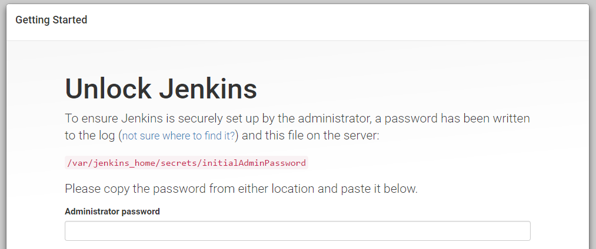
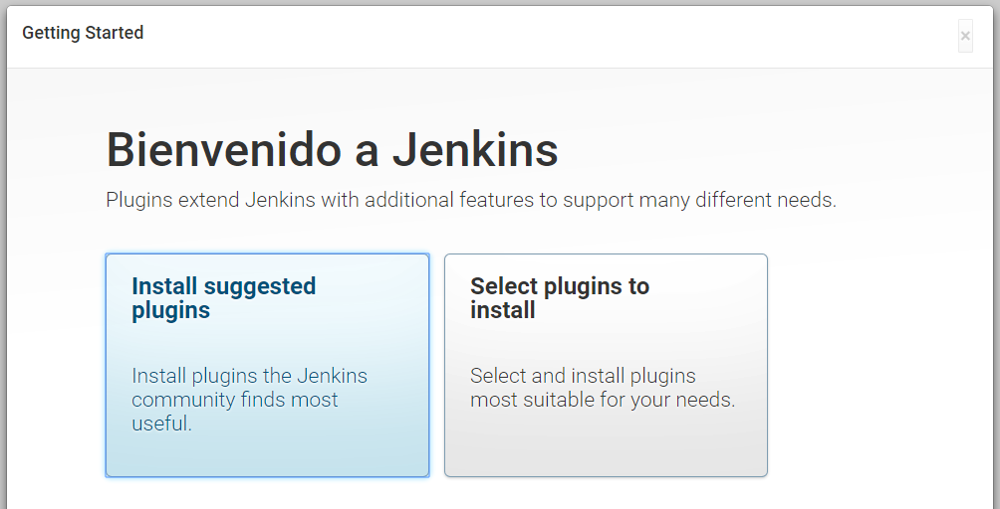
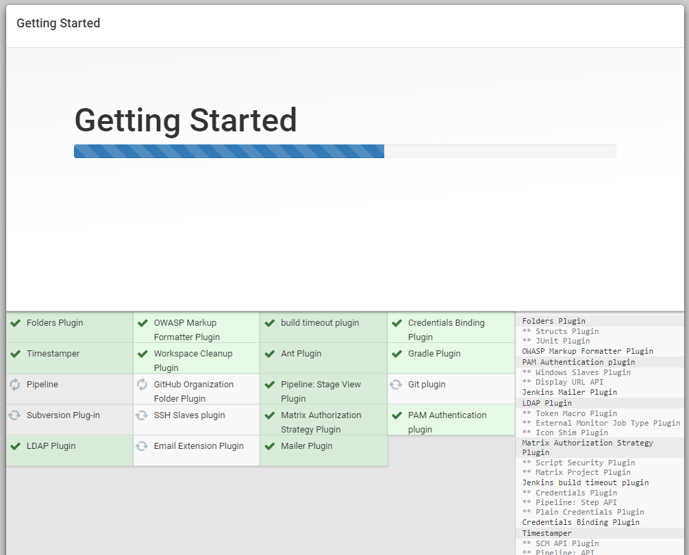
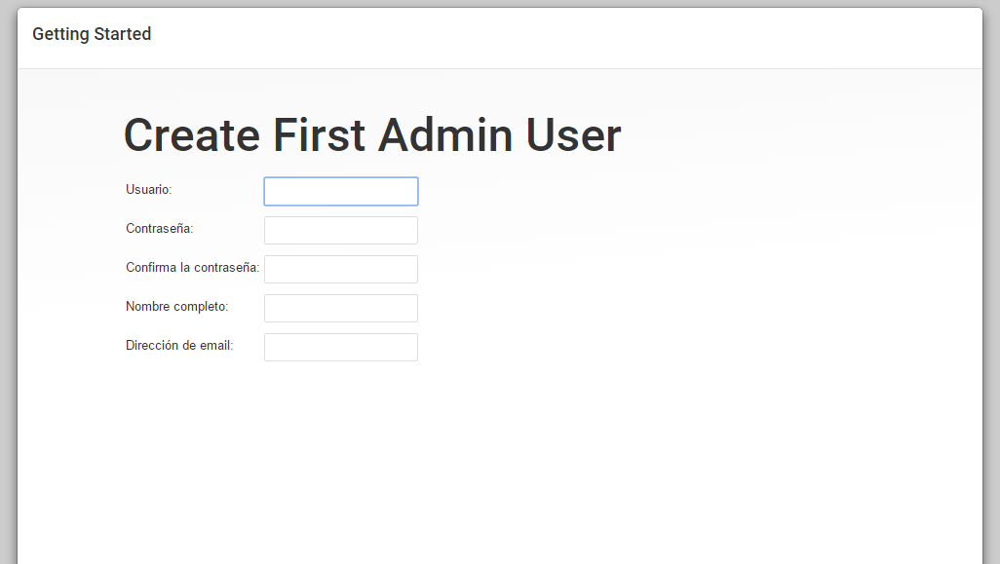
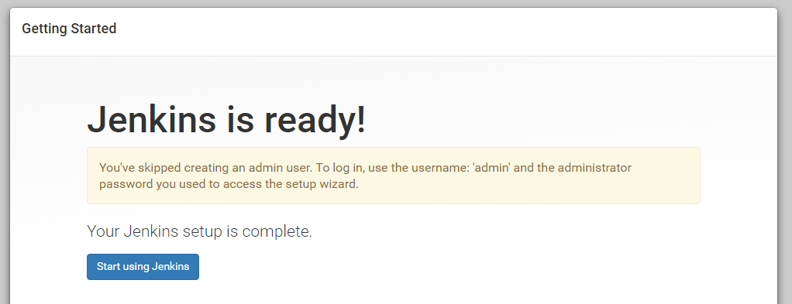
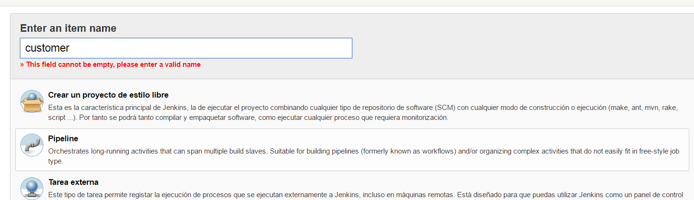
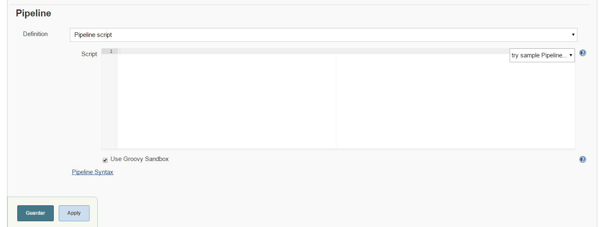

# Jenkins 

## Share Maven repo

Create a Volume to share the Maven repository with the Jenkins container. 

   - <your_.m2_path>/repository:/root/.m2/repository

## Share Docker engine 

Run docker command on the host machine from Jenkins container
 
Volumes:

 - /var/run/docker.sock:/var/run/docker.sock
 - /usr/bin/docker:/usr/bin/docker

Configuration: 

 user: root
 
 privileged: true  
 

## Share Docker Compose

Run docker-compose command from Jenkins container

Volumes: 

- /usr/local/bin/docker-compose:/usr/local/bin/docker-compose  

 If your are using **boot2docker** you'll need to install Docker Compose on the VM.  

```
docker-machine ssh default
sudo -i
rmdir /usr/local/bin/docker-compose
curl -L https://github.com/docker/compose/releases/download/1.14.0-rc2/docker-compose-`uname -s`-`uname -m` > /usr/local/bin/docker-compose
chmod +x /usr/local/bin/docker-compose 
```

## Run Jenkins Container

```
 $ docker-compose -f docker-compose-jenkins.yml up -d
```

 
```yml
version: '2.1'
services: 
  jenkins:
    image: jenkins:2.46.2
    volumes:     
      - /var/run/docker.sock:/var/run/docker.sock
      - /usr/bin/docker:/usr/bin/docker
      - /usr/local/bin/docker-compose:/usr/local/bin/docker-compose  
      - /lib64/libdevmapper.so.1.02:/usr/lib/libdevmapper.so.1.02:ro
      - /lib64/libsystemd-journal.so.0:/usr/lib/libsystemd-journal.so.0
      - /lib64/libsystemd-id128.so.0:/usr/lib/libsystemd-id128.so.0
      - /lib64/libgcrypt.so.11:/usr/lib/libgcrypt.so.11
      - /lib64/libdw.so.1:/usr/lib/libdw.so.1 
      - /c/Users/mocr/.m2/repository:/root/.m2/repository
    environment:
      - "JAVA_OPTS=-Duser.timezone=Europe/Madrid"
      - "JENKINS_OPTS= --prefix=/jenkins"
    ports:
      - "8080:8080"
      - "50000:50000"
      - "22000:22000"
    user: root
    privileged: true  
    restart: always
    container_name: jenkins     
networks:
  default:
    external:
      name: jbcnconf
```  

## Configure Jenkins 

http://$DOCKER_HOST_IP:8080/jenkins/

  
  
Go to Jenkins log and get the generated Admin password:  
  
  ```  
  $ docker logs jenkins

*************************************************************

Jenkins initial setup is required. An admin user has been created and a password generated.
Please use the following password to proceed to installation:

dc2c1bd08efa4a8f9d23a10693976806
```  

  

  Install suggested plugins 
  
  
  
    
  Create a use or just **Continue as admin**
  
  
   
  
  
  
  
  
  
  Create a Pipeline Job
  
  
  
  
  Create the Pipeline script
  
  
  

(TBDN)
 

 The pipeline script can be saved as a Jenkinsfile and stored into Git for version management. 

 

Customers Pipeline

```
pipeline {
    agent any
    tools {
        maven 'M3' 
    }
    stages {
        stage('Checkout') { 
            steps {
                git branch: 'master', url: 'https://github.com/Appverse/JBCNConf-Microservices_0-100.git'               
            }
        }
        stage('Build and Test Java code') {
            steps { 
                sh "mvn -f customers-service/pom.xml clean install"
            }
             post {
                success {
                    junit 'customers-service/target/surefire-reports/**/*.xml' 
                }
            }
        }
         stage('Deploy') {
             steps { 
                sh "docker-compose -f docker-compose-services.yml -p msworkshop up -d"
            } 
         }     
    }
}
```
