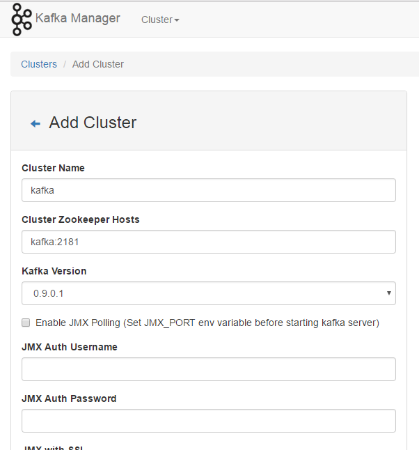
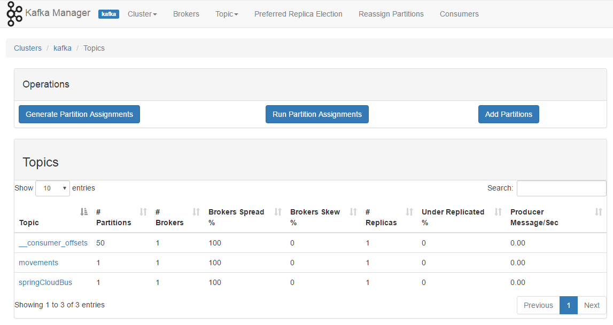

## Kafka manager
 
 Kafka manager allows to visualize the Kafka cluster through a web browser. 
  
 Docker Compose: 
 
 ```yml
   kafka_manager:
     image: sheepkiller/kafka-manager
     container_name: kafka_manager 
     ports:
       - 9000:9000
     depends_on:
       - kafka
     environment:
       - ZK_HOSTS=kafka:2181  
       - APPLICATION_SECRET=letmein
 ```

 Once Kafka Manager is running, go to *http://$DOCKER_HOST_IP:9000* with your browser. 
 
 You'll need to manually add the **kafka** cluster. 
 
 
 
 You can check the topics, delete them, list or update partitions, etc.
 
 