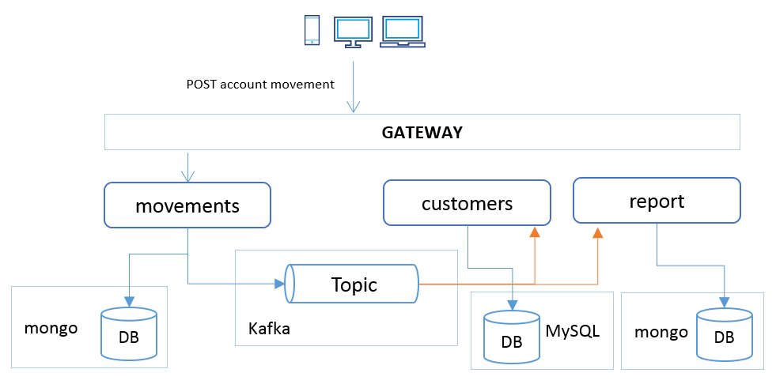

# Create Spring Boot Application Guide

This guide covers adding a new microservice to the architecture using Spring Boot and all the selected stack. 
This new microservice will generate some reporting about the account movements, listening on movements events.
It will use its own *mongo* database as a data store. 
The report service will expose a REST endpoint as well, but as a subresource of the Customer resource, ```customer/{id}/report```.  

A reporting example could be to summarize the movements by movement type.  

It will get some information about the Customer service, so we'll need to add Feign to perform some REST calls. This is just to demonstrate that we can combine different communication mechanisms within the architecture. 

   

Microservice stack:  
  
* Spring:

  * Config Server client  
  * Eureka client   
  * HATEOAS
  * Data MongoDB
  * Kafka  
  * Feign  
  * Hystrix


## Create the Spring Boot project

* Spring Boot Starter offers different ways of bootstrapping a new Spring Boot application. 
 
  * Use the Web
  
   [Spring Initializr](https://start.spring.io/)
   
   
  
  * Use the IDE ([STS](https://spring.io/tools)). 
  
    New > Spring Starter Project
   
     
     
     
  
  * Use the remote API  
  
    Get the project ZIP file using the Spring Starter API  
     http://start.spring.io/starter.zip?name=report-service&groupId=com.gft.jbcnconf&artifactId=report-service&version=0.0.1-SNAPSHOT&description=Account+Report+MS&packageName=com.gft.jbcnconf.report&type=maven-project&packaging=jar&javaVersion=1.8&language=java&bootVersion=1.5.4.RELEASE&dependencies=cloud-hystrix&dependencies=cloud-config-client&dependencies=cloud-eureka&dependencies=cloud-stream-binder-kafka&dependencies=cloud-feign&dependencies=data-mongodb

## Maven

Maven POM (pom.xml) updates.

### Parent POM

The parent POM will provide some dependencies to all the modules: Spring Web, Actuator, Jolokia and the Spring Boot Test starter.

Change the parent POM at the pom.xml file 

```xml
<parent>
  <groupId>com.gft.jbcnconf</groupId>
  <artifactId>ms-workshop</artifactId>
  <version>0.0.1-SNAPSHOT</version>
</parent>

```

### Maven properties

* Add Docker image prefix property.
* Add Docker Plugin version property. 

```xml
<properties>
  <project.build.sourceEncoding>UTF-8</project.build.sourceEncoding>
  <docker.image.prefix>jbcnconf</docker.image.prefix>
  <docker.plugin.version>0.4.13</docker.plugin.version>
</properties>
```

### Build plugins 

```xml 
<build>
  <finalName>report</finalName>
  <plugins>
    <plugin>
       <groupId>org.springframework.boot</groupId>
       <artifactId>spring-boot-maven-plugin</artifactId>
       <executions>
         <execution>
           <goals>
           <goal>build-info</goal>
           <goal>repackage</goal>
           </goals>
         </execution>
       </executions>
     </plugin>
    <plugin>
    <groupId>com.spotify</groupId>
    <artifactId>docker-maven-plugin</artifactId>
    <version>${docker.plugin.version}</version>
    <executions>
      <execution>
      <phase>package</phase>
        <goals>
        <goal>build</goal>
        </goals>
        </execution>
       </executions>
       <configuration>
       <imageName>${docker.image.prefix}/${project.artifactId}</imageName>
       <dockerDirectory>${project.basedir}/src/main/docker</dockerDirectory>
       <resources>
         <resource>
         <targetPath>/</targetPath>
         <directory>${project.build.directory}</directory>
         <include>${project.build.finalName}.jar</include>
         </resource>
       </resources>
      </configuration>
      </plugin>
    </plugins>
</build> 
```

### Module

Add the new module to the parent POM 

Edit the parent pom and add the module: 

```xml

<modules>
  <module>gateway</module>
  <module>discovery</module>
  <module>config</module>
  <module>admin-dashboard</module>
  <module>customers-service</module>
  <module>movements-service</module>
  <module>report-service</module>
</modules>
```

## Configuration 

### Logs

Create the **logback.xml** file under under **src/main/resources**. 

```xml
<?xml version="1.0" encoding="UTF-8"?>
<configuration>
  <include resource="org/springframework/boot/logging/logback/base.xml"/>
  <jmxConfigurator/>
</configuration>
```

### Bootstrap

Create a **bootsrap.yml** file under **src/main/resources**. 

```yml
server:
  port: 8080
spring: 
  application:
    name: report 
  cloud:  
    config:       
      uri: http://config:8888
      failFast: true
      user: user
      password: password
``` 

### Remote configuration

*report.yml* (This file already exists on the target Git repository)

It contains the configuration for: 

* The database configurations 

* The Kafka binders to consume events from *movements* topic. 

```yml
spring:  
  data:
    mongodb:
      host: reportdb
      port: 27017
      database: report 
  cloud: 
    stream:
      bindings: 
        input:
          destination: movements
          content-type: application/json  
          group: movementsReportGroup
```

### Configuration beans

#### Web 

Enable Web MVC configuration class at the  ```com.gft.jbcnconf.report.config```.

```java
@Configuration
@EnableWebMvc
public class WebMvcConfig extends WebMvcConfigurerAdapter {

    private ObjectMapper objectMapper;

    public WebMvcConfig(ObjectMapper objectMapper) {
        this.objectMapper = objectMapper;
    }
    /**
     * Message converters configuration.
     */
    @Override
    public void configureMessageConverters(List<HttpMessageConverter<?>> converters) {
        final MappingJackson2HttpMessageConverter converter = new MappingJackson2HttpMessageConverter();
        objectMapper.setSerializationInclusion(JsonInclude.Include.NON_NULL);
        objectMapper.configure(SerializationFeature.FAIL_ON_EMPTY_BEANS, false);        
        converter.setObjectMapper(objectMapper);
        converters.add(converter);
    }
 
    /**
     * Content negotiation configuration.
     */
    @Override
    public void configureContentNegotiation(ContentNegotiationConfigurer configurer) {
        configurer.defaultContentType(MediaType.APPLICATION_JSON);
    }
}
```

#### Bindings 

Add Stream bindings configuration for Kafka.

 Create a Event Listener class annotated with:
 
 ```java
 @EnableBinding(Sink.class)
 ```
 
 and then add a method for listening and process messages:
 
```java 
 	@StreamListener(Sink.INPUT)
	public void process(Message<?> message) {
 ``` 

### Unit testing

#### Database 

[Fongo](https://github.com/fakemongo/fongo) - is an in-memory java implementation of MongoDB
 
 ```xml
 <dependency>
   <groupId>com.github.fakemongo</groupId>
   <artifactId>fongo</artifactId>
   <version>2.1.0</version>
   <scope>test</scope>
 </dependency>
 ```

Build a MongoDB bean configuration to use with tests. 

* Create the package ```com.gft.jbcnconf.report.test.config``` under **src/test/java**.

* Create the *MongoConfiguration.java* class.

```java
@Configuration
@EnableMongoRepositories(basePackages = "com.gft.jbcnconf.report.repository")
public class MongoConfiguration extends AbstractMongoConfiguration { 

    @Override
    protected String getDatabaseName() {
        return "test";
    }

    @Override
    public Mongo mongo() throws Exception {
        return new Fongo(getDatabaseName()).getMongo();
    }
    
    @Override
    protected String getMappingBasePackage() {
        return "com.gft.jbcnconf.report.domain";
    } 
    
}
``` 

* Then you can use it when you want to use Fongo database instead of MongoDB
Example: 

```java
@RunWith(SpringRunner.class)
@DataMongoTest
@ActiveProfiles("test")
@ContextConfiguration(classes = { MongoConfiguration.class })
public class ReportRepositoryTest {
```

 
#### Isolation

When running Unit testing we need to avoid the external connections to Config Server and Eureka.
 
Create the *bootstrap.yml* under the **src/test/resources** folder. 

```yml
eureka:
  client:
    enabled: false

spring:
  cloud:
    config:
      enabled: false
```


## Docker 

The *Docker Maven Plugin* will build a Docker image on the *install* phase, then we need to provide a Dockerfile 

- Create the folder **src/main/docker**

- Create a *Dockerfile* file at the **src/main/docker** directory. 

```
FROM java:8-jre-alpine
VOLUME /tmp
ADD report.jar /app.jar 
ENTRYPOINT ["java","-Djava.security.egd=file:/dev/./urandom","-jar","/app.jar"]
```

### Docker Compose 

Add the new services to the **docker-compose-services.yml** file.  

```yml
  reportdb:
    image: mongo
    restart: on-failure:10
    container_name: reportdb     
  
  report:  
    image: jbcnconf/report-service
    restart: on-failure:10 
    depends_on:
      - reportdb   
```


 

